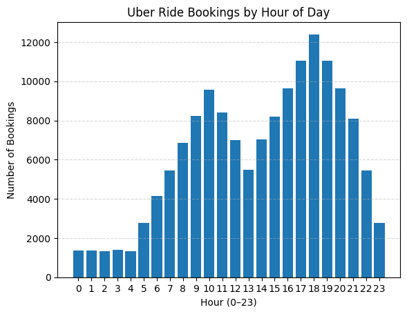
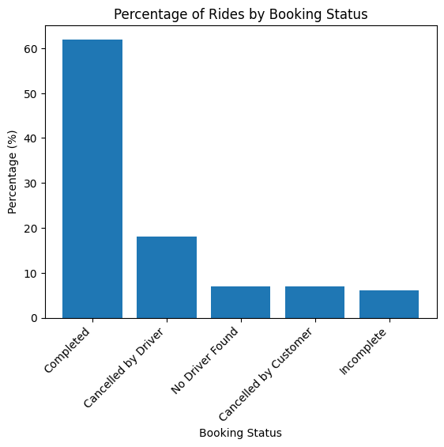
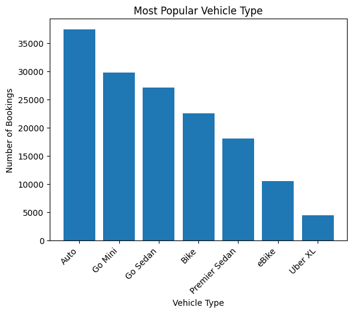

# Uber
I am analysing 2024 Uber ride-sharing data from the NCR region in India to understand booking patterns, cancellations, customer behavior, and ride performance.

The dataset captures 148,770 Uber bookings across multiple vehicle types in 2024, providing a complete view of ride-sharing operations. It includes information on successful rides, cancellations, customer behaviors, and financial metrics. Of the total bookings, 65.96% (approximately 93,000 rides) were successfully completed, while 25% (around 37,430 rides) were cancelled. Customer cancellations accounted for 19.15% (about 27,000 rides) and driver cancellations for 7.45% (roughly 10,500 rides). This rich dataset enables in-depth analysis of booking patterns, vehicle performance, revenue trends, and factors affecting ride completion and customer satisfaction.

## Exploratory Data Analysis

**Uber Rides by time of day:**

From the chart, it is noticeable that morning and evening periods record the highest number of bookings, aligning closely with typical commuting hours. These peaks are likely driven by customers travelling to and from work, school, and other daily activities.

In contrast, nighttime bookings are significantly lower. This reduction may be attributed to several factors, such as decreased travel demand outside rush hours, prices costing more at night, and lower overall mobility as most people are at home or sleeping.

Overall, the distribution highlights a strong correlation between ride demand and daily commuting patterns, with demand declining as the day moves into late-night periods.

**Uber Rides by Hour of Day:**

The graph displays a bimodal distribution, indicating two distinct peaks in booking activity throughout the day.

The first peak occurs at 10 AM, which is interesting as it falls slightly after the traditional morning rush hour. This may suggest continued travel demand beyond early commuting hours, such as flexible work schedules, late starts, or non-work-related trips, including running errands and appointments.

The second and more prominent peak appears at 6 PM (which is also the busiest time of day for Uber bookings), aligns closely with the evening rush hour. This period usually represents the highest daily demand as commuters return home from work and overall Uber traffic increases.

Overall, the bimodal pattern highlights how Uber ride demand closely follows daily movement behaviour, with sustained activity extending beyond strict commuting windows and peaking most strongly in the evening.

**Uber Rides: Non-Rush Hour vs Rush Hour:**

I used Rush hour periods of 6:00 AM to 9:00 AM and 4:00 PM to 7:00 PM, as these time ranges most logically represent typical commuting patterns.

The morning window captures travel related to work, school, and university commutes, while the evening window reflects the return journeys home from these activities.

The chart indicates that non-rush-hour rides account for a greater proportion of total bookings than rush-hour rides. This outcome is expected, as travel demand is not limited to commuting alone. People require transportation throughout the day for a wide range of purposes, including errands, social activities, appointments, and leisure travel.

Overall, while rush hours represent periods of concentrated demand, the results demonstrate that Uber usage remains consistently high across non-peak periods, highlighting the platform’s importance as an all-day transportation service rather than one used exclusively during commuting hours.

**Uber Rides based on Booking Status:**

Out of a total of 150,000 rides, 93,000 were successfully completed, representing a 62% completion rate. 
This means that 38% of rides were not completed due to driver cancellations, no driver being available, customer cancellations, or incomplete. 
A 62% completion rate is relatively low; as an Uber customer, I would expect this figure to be above 85% for a reliable service experience. 

**Customer Cancellation Relations:**

Out of 10,500 customer cancellations, many, such as those caused by incorrect addresses or changes in plans, are beyond the driver’s control. 
However, cancellations resulting from the driver not moving to the pickup location, requesting to cancel, or AC is not working are the driver’s responsibility. 
Reducing these driver-related cancellations would significantly improve the overall completion rate.

**Investigating Vehicle Types:**

Among the Uber bookings, the most popular vehicle type is Auto, with 37,419 rides, followed by Go Mini at 29,806 rides and Go Sedan at 27,141 rides. 
Together, these three vehicle types account for a significant portion of total bookings, indicating a strong preference for smaller, more affordable options.

Two-wheeled options, Bike and eBike, also represent a notable share with 22,517 and 10,557 rides respectively, suggesting that riders value quick and flexible transport for shorter distances or congested areas.

Premium options like Premier Sedan have 18,111 bookings, showing some demand for comfort and higher-end service. 

The Uber XL category is the least utilized, with only 4,449 bookings, reflecting lower demand for larger capacity vehicles.

Overall, the data indicates that the majority of Uber users prefer cost-effective and compact vehicles, while premium and larger capacity options remain niche segments.

**Key Metrics Analysis (Averages):**

Ride Distance (kms): 24.64

Booking Value ($): 10.17

Driver Rating: 4.23

Customer Rating: 4.4

VTAT: 8.46

CTAT: 29.15

Reviewing the average values across key metrics provides meaningful insight into overall ride behaviour and service performance.

The average ride distance of 24.64 km suggests that a large proportion of Uber trips fall within the medium to long distance range, indicating usage beyond short inner city travel and extending to cross suburb or intercity journeys.

As the dataset originates from India, booking values were converted from Indian Rupees to New Zealand Dollars to improve interpretability. The average booking value of $10.17 NZD is relatively low compared to typical Uber fares in New Zealand where trips often exceed $20. This difference is likely influenced by India’s lower cost of living, lower fuel and labour costs, and greater availability of low cost vehicle options such as bikes and autos.

The average driver rating of 4.23 indicates that customers generally experienced satisfactory service. However, the score also suggests there is room for improvement, potentially related to factors such as traffic delays, pickup wait times, or ride comfort.

The average customer rating of 4.40 is higher than the driver rating, implying that riders are generally perceived more positively by drivers. This may reflect cooperative rider behaviour and relatively smooth trip interactions.

The average VTAT (Vehicle Time to Arrive) of 8.46 minutes is moderately high. This may be attributed to high population density, congested road networks, and heavy traffic conditions in major Indian cities, all of which can increase pickup times and potentially contribute to ride cancellations.

The average CTAT (Customer Trip Time) of 29.15 minutes aligns closely with the average ride distance. Longer travel distances naturally result in extended trip durations, reinforcing the observation that a substantial portion of bookings involve medium to long journeys.

### Executive Summary
The peak booking time is 6 PM, coinciding with evening rush hour. 
However there were more non rush hour bookings than rush hour due to bookings occuring throughout the day, reflecting Uber’s role as a reliable transport option at all times.

The overall ride completion rate is 62%, highlighting room for improvement. 
Many customer cancellations are linked to driver related issues, suggesting that stricter enforcement of driver accountability could increase completion rates.

Vehicle preferences show a strong demand for affordable options, with Auto and Go Mini leading, followed by bikes. 
Premium rides such as Premier Sedan have a smaller but notable market, indicating a segment for luxury travel.

Overall, the data provides key insights into customer behavior and operational performance, highlighting opportunities to enhance service reliability and meet rider demand more effectively.

