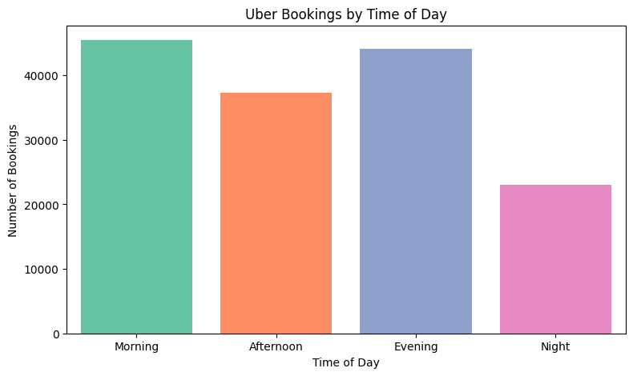

# Uber
I am analysing 2024 Uber ride-sharing data to understand booking patterns, cancellations, customer behavior, and ride performance.

The dataset captures 148,770 Uber bookings across multiple vehicle types in 2024, providing a complete view of ride-sharing operations. It includes information on successful rides, cancellations, customer behaviors, and financial metrics. Of the total bookings, 65.96% (approximately 93,000 rides) were successfully completed, while 25% (around 37,430 rides) were cancelled. Customer cancellations accounted for 19.15% (about 27,000 rides) and driver cancellations for 7.45% (roughly 10,500 rides). This rich dataset enables in-depth analysis of booking patterns, vehicle performance, revenue trends, and factors affecting ride completion and customer satisfaction.

Here’s a plot I've created showing bookings by time of day:

